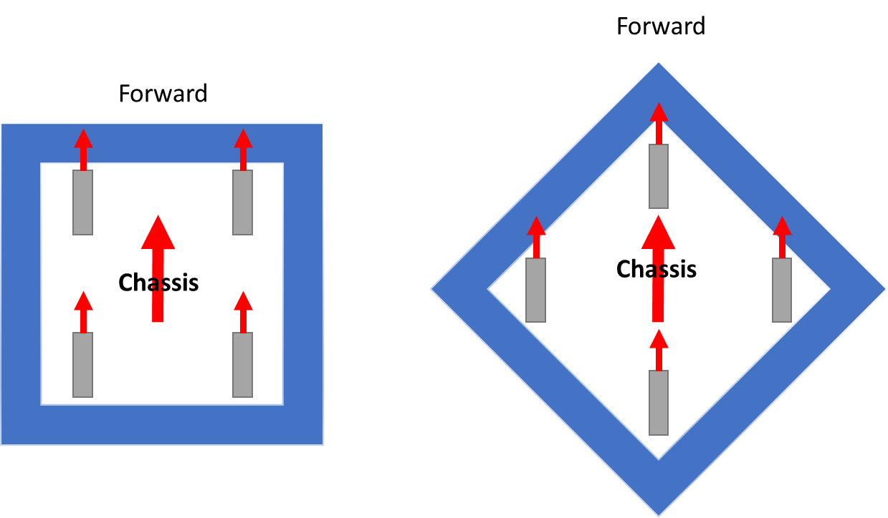
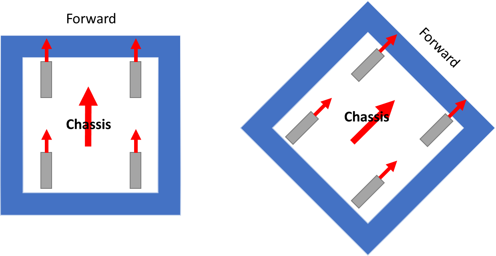

# Swerve Drive
A swerve drivetrain is a special type of drivetrain where each individual wheel is independently driven and steered. This is also known as a holonomic drivetrain.

Description automatically generated
There are 3 different things a swerve drive can do:
1. Move in any direction (this is called translating)
2. Turn in place
3. Turn while moving

These are all done with different wheel arrangements

## Field Centric
In field centric mode control is from the perspective of the driver. This means that, no matter where the robot is on the field and how it is turned, if the driver moves the joystick forward, then the robot will go forward from the driver’s perspective.  The robot uses absolute orientation.

This type of control requires a gyro (which any swerve drive robot should have).  The gyro gives the angle the robot is facing relative to the angle it was at when it was calibrated (let us assume for now that is forward). To transform the joystick inputs into field-relative coordinates, follow these steps:

1. Convert the joystick cartesian coordinates (x, y) into polar coordinates (r, θ)
2. Subtract the gyro angle from the joystick angle
3. Convert back to cartesian coordinates

The new (x, y) coordinates are now “field-relative.”

## Robot Centric
In robot centric mode, however, if the robot were turned to the right, then the robot would go rightwards from the driver’s perspective.  The robot drives like a standard differential drive.  This mode can be used to help the driver (or autonomous control) align the robot to a target.

# Manual Control
When the robot is controlled by the driver, the joystick inputs for control are the desired translation and rotation velocities.  This maps to kinematics definitions of a velocity vector (Vx, Vy) and angular rotation (θ) in rad/s. These are also commonly referred to as forward (Vx), strafe (Vy), rotation (θ).  Additionally, an indicator of whether the robot is driving field-oriented is provided.The inputs are used to calculate each module’s translational and angular velocity. 

# Autonomous Control
When the robot is controlled autonomously by commanding it to drive a certain path generating a trajectory and following it.  The output of the trajectory follower is the same as for Manual Control:  forward (Vx), strafe (Vy), rotation (θ) velocities as a percentage as well as the field-oriented flag.

For example, 1690 Orbitz use the following algorithm from 2020:

1. The trajectory generator provides for each point : time, X, Y, Vx, Vy, Heading, Theta (θ  rotational velocity), is_vision_needed?
2. Feed forward to our swerve algorithm (same as teleop) Vx,Vy, θ  (same as field centric joystick inputs)
3. Every cycle we calculate the robot location based on the 4 wheels encoders, 4 steering angles and Gyro reading
4. Calculate the difference between the wanted location from the path and the actual location and add k* that vector to the next cycle’s wanted velocity
5. Same for heading … add to the theta K* heading error
6. When combining vision - we calculate the location error from the vision algorithm and gradually give it more “power” while reducing the path location feedback correction “power” so the vision control gradually takes over.

Nothing too fancy … although it took some tuning to get it running really smooth and accurate.\

# Subsystems and Their Responsibilities
Dividing the responsibilities for the different subsystems is the essential principle of encapsulation.  The main subsystems are Swerve Drive, Swerve Module, and Robot State Estimator.

## Swerve Module
A Swerve Module is responsible for controlling the drive and steer motors.The control strategy depends on the motors. E.g. if using Falcon 500s, the drive motor velocity by percent out open-loop control and the rotation angle by using position or motion-magic closed-loop control.Similarly, if not using motor controllers, basic feedforward PID controls can be used.

## Swerve Drive
The Swerve Drive is responsible for taking the commanded inputs and applying inverse kinematics to command each Swerve Module’s, drive velocity and rotation angle.  Whether commanded inputs are generated by manually by driver or by a trajectory follower, vision goal alignment, etc. they are always in the form of forward (Vx), strafe (Vy), rotation (θ) velocities and a field-oriented flag.

## Normalizing Velocities
It is important to note that drive motor velocities must be normalized as the resulting vector for any given input (Vx, Vy) can exceed 1.0:  V = sqrt(Vx2 + Vy2) <= sqrt(2) which is roughly 1.41.   There are three strategies that can be used:

1. **Clamping** – take min(velocity, 1.0) for each module.  The problem with this naïve approach is that it distorts the final direction.
2. **Pre-normalize** – this method relies on finding the highest possible velocity and scaling down each value if it is greater than 1.0.  While values are guaranteed not to exceed 1.0, it may be too conservative in some cases.
3. **Post-normalize** – takes all the velocities and divides them by the highest, if it’s larger than 1.0.  This method produces the best results as it preserves the final direction without being conservative.

##  Swerve Heading Controller
The Swerve Heading Controller is responsible making sure a given heading is followed.  It does so by comparing the gyro reading against the setpoint heading to compensate the overall rotation angle before the inverse kinematics are applied. 

## Robot State 
The Robot State keeps track of the key data such as odometry – where the robot is on the field as well as its’ current velocities, goal tracking – what the angles and distances are to goal objects, etc.  The Robot State is updated every cycle with timestamped data and supports interpolation between two different time indices.

##  Trajectory Generator
The Trajectory Generator is responsible for calculating a trajectory for a given path.  A path is defined as a series of field coordinates (x, y) commonly known as waypoints.When following a path, it is expected that the robot drive through waypoints.  Additionally, the robot can be asked to face heading at each waypoint.This can be useful in narrow passages, etc.  The path between waypoints is defined by fitting a spline to the waypoints to create a smooth path.  The spline is then parametrized by time by sub-dividing the spline in small time increments generating sections that obey the dynamic constraints of the robot such and max translational velocity, max translational acceleration, max translational jerk, max angular velocity and max angular acceleration.  For each trajectory segment, the position (x, y) and velocity (Vx and Vy) and acceleration (Ax and Ay) is calculated as well as the rotation angle and θ velocity. 

## Trajectory Follower
The Trajectory Follower is a controller that compares the current position returned by the robot odometry from the Robot State against the expected position for the current time index of the trajectory and calculates the gains required to follow the trajectory adjusting for any drift.  Different control strategies can apply like feedforward error-correcting or pure pursuit.The output of the control strategy is the same as for Controls:  forward (Vx), strafe (Vy), rotation (θ) velocities as a percentage and the field-oriented flag.
